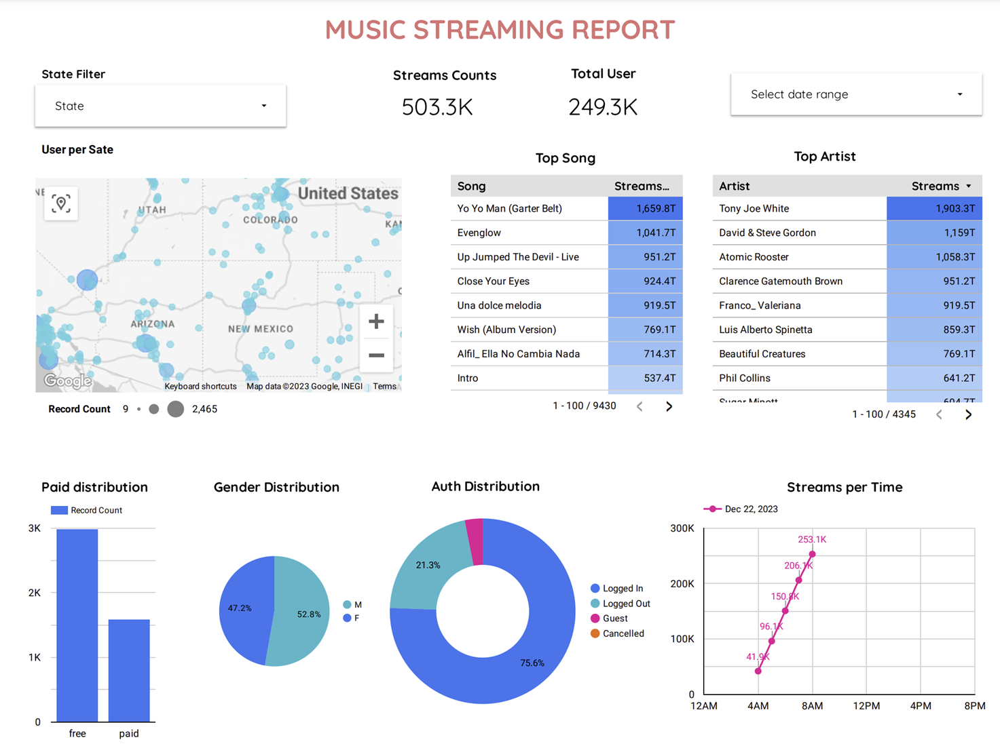

# Streamify

A data pipeline with Kafka, Spark Streaming, dbt, Docker, Airflow, Terraform, GCP and Google Colab. Thanks to [DataTalks.Club](https://datatalks.club) and [Ankur Chavda](https://github.com/ankurchavda) for the inspiration. This project is a modified version of [Streamify](https://github.com/ankurchavda), that contains a few additional features like Kafka, Docker, Google Colab, Data Studio and RecSys.

## Description

### Objective

The project will stream events generated from a fake music streaming service (like Spotify) and create a data pipeline that consumes the real-time data. The data coming in would be similar to an event of a user listening to a song, navigating on the website, authenticating. The data would be processed in real-time and stored to the data lake periodically (every one minutes). The 5-minutes batch job will then consume this data, apply transformations, and create the desired tables for our dashboard to generate analytics. The dashboard will be created using Data Studio and will be used to visualize the data. The data will also be used to train a recommendation system that will be deployed as a web-based demo using Gradio. The project will be deployed on Google Cloud Platform using Terraform.

### Dataset

[Eventsim](https://github.com/Interana/eventsim) is a program that generates event data to replicate page requests for a fake music web site. The results look like real use data, but are totally fake. The docker image is borrowed from [viirya's fork](https://github.com/viirya/eventsim) of it, as the original project has gone without maintenance for a few years now.

Eventsim uses song data from [Million Songs Dataset](http://millionsongdataset.com) to generate events. I have used a [subset](http://millionsongdataset.com/pages/getting-dataset/#subset) of 10000 songs as project [Streamify](https://github.com/ankurchavda).

### Tools & Technologies

- Cloud - [**Google Cloud Platform**](https://cloud.google.com)
- Infrastructure as Code software - [**Terraform**](https://www.terraform.io)
- Containerization - [**Docker**](https://www.docker.com), [**Docker Compose**](https://docs.docker.com/compose/)
- Stream Processing - [**Kafka**](https://kafka.apache.org), [**Spark Streaming**](https://spark.apache.org/docs/latest/streaming-programming-guide.html)
- Orchestration - [**Airflow**](https://airflow.apache.org)
- Transformation - [**dbt**](https://www.getdbt.com)
- Data Lake - [**Google Cloud Storage**](https://cloud.google.com/storage)
- Data Warehouse - [**BigQuery**](https://cloud.google.com/bigquery)
- Data Visualization - [**Data Studio**](https://datastudio.google.com/overview)
- Notebook - [**Google Colab**](https://colab.research.google.com)
- ML UI Web-based Demos - [**Gradio**](https://gradio.app)
- Language - [**Python**](https://www.python.org)

### Architecture


### Final Result


## Setup

**WARNING: You will be charged for all the infra setup. You can avail 300$ in credit by creating a new account on GCP.**
### Pre-requisites

If you already have a Google Cloud account and a working terraform setup, you can skip the pre-requisite steps.

- Google Cloud Platform. 
  - [GCP Account and Access Setup](setup/gcp.md)
  - [gcloud alternate installation method - Windows](https://github.com/DataTalksClub/data-engineering-zoomcamp/blob/main/week_1_basics_n_setup/1_terraform_gcp/windows.md#google-cloud-sdk)
- Terraform
  - [Setup Terraform](https://github.com/DataTalksClub/data-engineering-zoomcamp/blob/main/week_1_basics_n_setup/1_terraform_gcp/windows.md#terraform)


### Get Going!
All commands:

#### Set terraform
Open a new terminal and run the following commands:
```bash
terraform init
terraform plan
terraform apply
terraform destroy # for destroy after apply
```

#### Set ssh config
```bash
# check ip address in GCP and paste it in ~/.ssh/config
code ~/.ssh/config # ssh streamify-kafka
```
#### Set kafka
Open a new terminal and run the following commands:
```bash
ssh streamify-kafka

git clone https://github.com/ndlongvn/streamify.git 

bash ~/streamify/scripts/vm_setup.sh && \
exec newgrp docker
```
Get the IP address of the kafka VM and export it in the `KAFKA_ADDRESS` variable.

```bash

export KAFKA_ADDRESS=IP.ADD.RE.SS

cd ~/streamify/kafka && \
docker-compose build && \
docker-compose up -d
```
After this, you can forward port 9021 from kafka VM using Vscode ssh-remote to see kafka ui.


#### Set eventsim for kafka
```bash

bash ~/streamify/scripts/eventsim_startup.sh
```
To see the logs of the eventsim container, run the following command:
```bash

docker logs --follow million_events
```

#### Set spark
Open a new terminal and run the following commands:
```bash

ssh streamify-spark

git clone https://github.com/ndlongvn/streamify.git && \
cd streamify/spark_streaming

export KAFKA_ADDRESS=IP.ADD.RE.SS
export GCP_GCS_BUCKET=GCP_GCS_BUCKET
```
In my case, the GCP_GCS_BUCKET is bigdata-project-it4931

```bash

export GCP_GCS_BUCKET=bigdata-project-it4931
```
Run spark streaming job in background:
```bash

nohup spark-submit --packages org.apache.spark:spark-sql-kafka-0-10_2.12:3.1.2 stream_all_events.py > spark_log.log &

tail -f spark_log.log
```

You can forward port 8088 or 9870 or 18080 from spark VM using Vscode ssh-remote to see spark ui. (http://localhost:8088/proxy/)

#### Set airflow
Open a new terminal and run the following commands:
```bash
ssh streamify-airflow

git clone https://github.com/ndlongvn/streamify.git && \
cd streamify

bash ~/streamify/scripts/vm_setup.sh && \
exec newgrp docker
```
Move google_credentials.json file from local to the VM machine in ~/.google/credentials/ directory.  
```bash
cd ~/.google/credentials
nano google_credentials.json # and paster the content of the file in the nano editor

```
Set GCP_PROJECT_ID and GCP_GCS_BUCKET
```bash

export GCP_PROJECT_ID=GCP_PROJECT_ID
export GCP_GCS_BUCKET=GCP_GCS_BUCKET
```
In my case, the GCP_PROJECT_ID is deft-manifest-406205 and GCP_GCS_BUCKET is bigdata-project-it4931

```bash

export GCP_PROJECT_ID=deft-manifest-406205
export GCP_GCS_BUCKET=bigdata-project-it4931

bash ~/streamify/scripts/airflow_startup.sh && cd ~/streamify/airflow

docker-compose logs --follow
```

#### Run dags in Aitflow
Using ssh-remote to forward port 8080 from airflow VM to localhost. Then go to http://localhost:8080 to see airflow ui.
Username: airflow
Password: airflow

Run the following dags in order:

* Step1: load_songs_dag

* Step2: streamify_dag

#### Set RecSys

Open Recommendation System.ipynb in [google colab folder](https://github.com/ndlongvn/streamify/tree/main/google_colab) and run all cells.


#### Finish
```bash
terraform destroy
```


